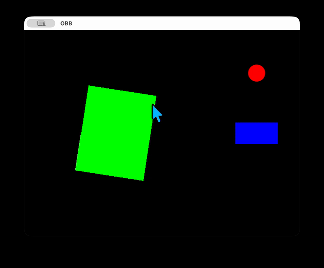

# Pure GO 2D Game Collision example(OBB & Circle)





A lightweight, high-performance, and **zero-dependency** 2D game collision checking example built from scratch in Go.

This repository provides boilerplate code and educational references for top-down 2D games using **Ebitengine (Ebiten v2)**.

https://ebitengine.org/


## Key Features

- **Zero-Copy & Memory Optimized**
- **OBB vs OBB (SAT Theory)**
- **OBB vs Circle**


## Mathmetical Overview

### 1. OBB vs OBB Collision(Separating Axis Theorem)

Projects all vertices of both bounding boxes onto 4 potential separating axes. If there is even one axis where the projections do not overlamp, it immediately short-circuits and returns ```false```, ensuring fast collision detection.


### 2. OBB vs Circle Collision(Inverse Transform & Clamping)

Instead of expensive loop operations, it projects the world coordinates into the OBB's local coordinate system. It then **clamps** the circle's center into 9 distinct zones to find the closest point on the box instantly.


## Quick Start

### Prerequisites

Make sure you have Go installed and the Ebitengine configured on your system.

```bash
go mod init purego-2d-collision

go get [github.com/hajimehoshi/ebiten/v2](https://github.com/hajimehoshi/ebiten/v2)

go run .
```


### Controls

- ```Arrow Up / Down```: Drive the Truck(Foward/Reverse)
- ```Arrow Left / Arrow Right```: Steer the Truck
- **Blue Box**: Controlled Truck(OBB)
- **Green Box**: Static Building(OBB)
- **Red Circle**: Enemy Zombie(Circle)